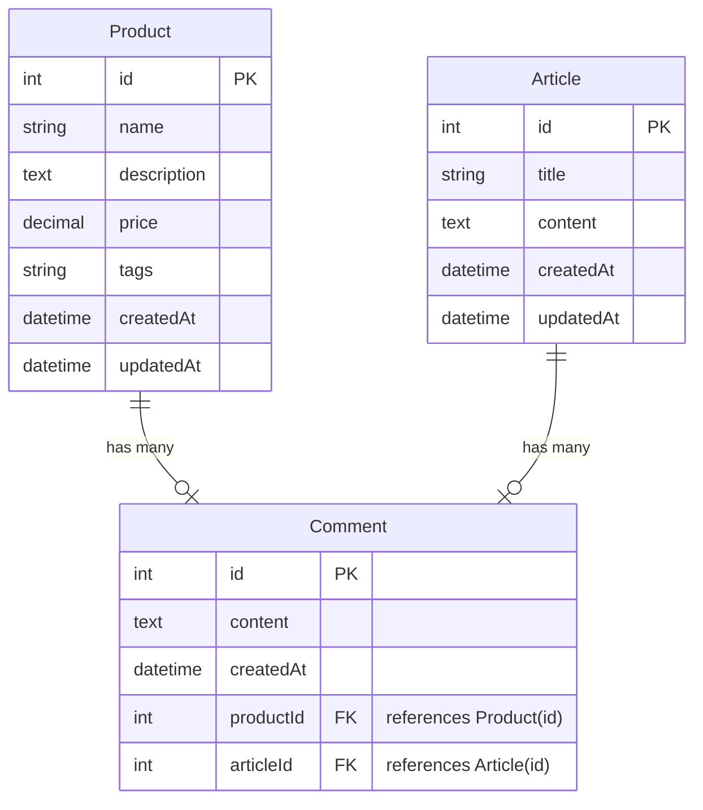

# 2-sprint-mission

```mermaid
erDiagram
Product {
int id PK
string name
text description
decimal price
string tags
datetime createdAt
datetime updatedAt
}

    Article {
        int id PK
        string title
        text content
        datetime createdAt
        datetime updatedAt
    }

    Comment {
        int id PK
        text content
        datetime createdAt
        int productId FK "references Product(id)"
        int articleId FK "references Article(id)"
    }

    Product ||--o| Comment: "has many"
    Article ||--o| Comment: "has many"
```
